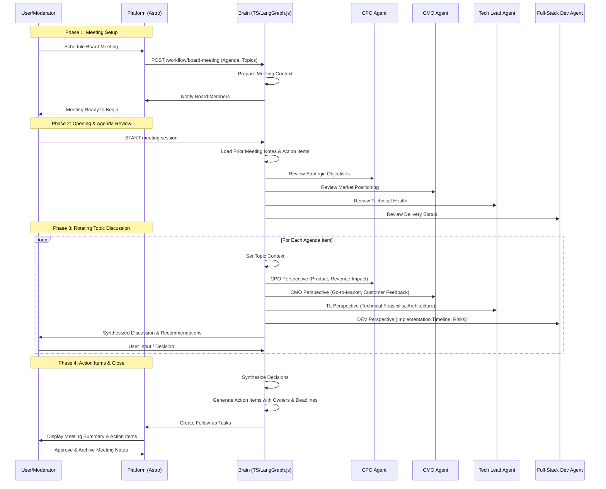

# Board Meeting Workflow (Strategic Sync 📊)

**Objective**: Facilitate structured conversations between board members to discuss strategy, progress, and decisions.
**Trigger**: Scheduled meeting or user-initiated board sync request.

## Workflow Diagram



## Phases

### Phase 1: Meeting Setup

1. User schedules board meeting with agenda and topics
2. Platform prepares meeting context (prior notes, action items)
3. Brain notifies all board members
4. Meeting is ready to begin

### Phase 2: Opening & Status Review

1. Moderator starts meeting session
2. Brain loads prior meeting notes and action items
3. Each agent provides status update in their domain:
   - **CPO**: Strategic objectives and product progress
   - **CMO**: Market positioning and customer feedback
   - **Tech Lead**: Technical health and architecture
   - **Dev Agent**: Delivery status and timeline

### Phase 3: Topic Discussion (Rotating Perspectives)

For each agenda item:

1. Brain sets topic context
2. Each agent provides their perspective:
   - **CPO Agent**: Product viability, revenue impact, market fit
   - **CMO Agent**: Go-to-market strategy, customer perception, brand alignment
   - **Tech Lead Agent**: Technical feasibility, architecture implications, risk assessment
   - **Dev Agent**: Implementation timeline, technical debt, resource requirements
3. Brain synthesizes discussion into recommendations
4. Moderator makes decision or defers for further analysis

### Phase 4: Action Items & Close

1. Brain synthesizes all decisions
2. Generates action items with:
   - Clear ownership (assigned agent/person)
   - Specific deadline
   - Success criteria
3. Follow-up tasks created in platform
4. Meeting notes and decisions archived

## Participants & Roles

- **CPO Agent**: Drives product vision, market fit, revenue strategy
- **CMO Agent**: Focuses on brand, messaging, customer perception, go-to-market
- **Tech Lead Agent**: Ensures technical feasibility, architecture alignment, risk assessment
- **Full-Stack Dev Agent**: Provides implementation insights, delivery timelines, technical debt
- **User/Moderator**: Facilitates discussion, makes final decisions, provides business context

## Key Features

1. **Contextual Discussion**: Each agent provides perspective based on their domain expertise
2. **Decision Synthesis**: Brain synthesizes viewpoints into actionable recommendations
3. **Action Item Tracking**: Automatic generation of follow-up tasks with owners and deadlines
4. **Meeting Archive**: Full notes saved for audit trail and future reference
5. **Pattern Recognition**: System learns from past decisions to inform future meetings

## Meeting Agenda Template

When scheduling a board meeting, include:

- **Meeting Date & Time**
- **Attendees** (which agents)
- **Agenda Items** (topics to discuss)
- **Context Documents** (PRD, metrics, feedback, etc.)
- **Decisions Needed** (what decisions must be made)
- **Success Criteria** (how we'll measure success)

---

## Lessons Learned (Feb 26, 2026 - First Board Meeting)

### What Worked Well

1. **Step-by-Step Discussion** - Breaking complex topics (mission, values, copy, design) into sequential agenda items prevented decision fatigue and allowed deep focus
2. **Synthetic Perspectives** - Having CPO, CMO, Copywriter, Visual Designer present unique viewpoints (not just generic consultants) added genuine value
3. **Challenge & Refinement** - Iterative refinement (e.g., "this copy feels AI-generated, make it more human") led to authentic output
4. **Documentation as You Go** - Creating docs (mission_and_values.md, backlog.md) during the meeting vs. after kept decisions locked and clear
5. **Real Data Wins** - Shifting from vanity metrics (15+ years) to actual client outcomes (75% TTM reduction) was high-impact and credible

### Best Practices Established

1. **Pause for Clarity** - When proposing options, explicitly ask "which resonates?" rather than continuing without alignment
2. **Lock Decisions Immediately** - Don't move forward until decision is documented and stored
3. **Use Templates for Consistency** - Board meeting notes template helped capture all relevant info systematically
4. **Create Supporting Docs** - Separate docs for mission/values, backlog, meeting notes improves searchability and team reference
5. **Session-Based Agenda** - Moving items in sequence with clear status (✅ complete, ⏳ pending) keeps momentum

### Process Improvements for Future Meetings

1. **Develop Meeting Playbooks** - Create templates for recurring meeting types (strategy sync, retrospective, planning)
2. **Pre-Meeting Brief** - Have agents prepare 30-second takes before rotating discussion to save time
3. **Decision Log** - Maintain a running decision log with yes/no and rationale for audit trail
4. **Async Feedback Loop** - For decisions needing wider input, post to docs/meeting_notes/ for async feedback before finalizing
5. **Follow-up Metric Tracking** - Review action items' success metrics in next meeting to close the loop

### Documentation Structure

For board meetings, maintain this structure:

```
docs/
├── mission_and_values.md        # Locked strategic direction
├── backlog.md                   # Prioritized action items
└── meeting_notes/
    └── board_meeting_notes_YYYY-MM-DD.md
```

Each meeting notes file should include:

- Attendees and facilitator
- Agenda items with status
- Key decisions with rationale
- Approved copy/design changes
- Action items with owners, deadlines, and success criteria
- Success metrics to track
