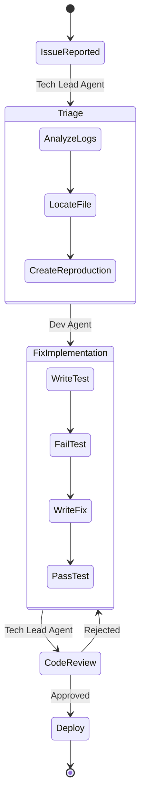

# Bug Fix Workflow (Maintenance 🛠️)

**Objective**: Resolve errors or bugs reported by users or monitoring.
**Trigger**: Error log or user report.

## Workflow Diagram

## Phases

### Phase 1: Triage

1. Tech Lead Agent receives bug report or error log
2. Analyzes logs and traces root cause
3. Locates affected files in codebase
4. Creates reproduction steps to verify the issue

### Phase 2: Fix Implementation (Test-First)

1. Dev Agent writes failing test that captures the bug
2. Verifies test fails (confirms reproduction)
3. Writes fix code
4. Verifies test now passes
5. Ensures no other tests break

### Phase 3: Code Review

1. Tech Lead reviews the fix:
   - Does it solve the root cause?
   - Are there edge cases?
   - Does it follow code standards?
   - Are tests adequate?
2. If approved: deploy
3. If rejected: send back to Dev Agent with feedback

### Phase 4: Deployment

1. Deploy fix to production
2. Monitor logs for related errors
3. Close issue

## Agents Involved

- **Tech Lead Agent**: Triage, root cause analysis, code review
- **Dev Agent**: Fix implementation, testing, error handling

## Bug Classification

| Severity | Response Time | Process                       |
| -------- | ------------- | ----------------------------- |
| Critical | Immediate     | Direct fix, fast track review |
| High     | 2-4 hours     | Full triage, standard process |
| Medium   | Next day      | Standard process              |
| Low      | Week          | Can batch with other fixes    |

## Testing Requirements

All bug fixes must include:

1. Unit test that reproduces the bug
2. Unit test that verifies the fix
3. Integration tests if the bug spans multiple systems
4. No regression in existing test suite
