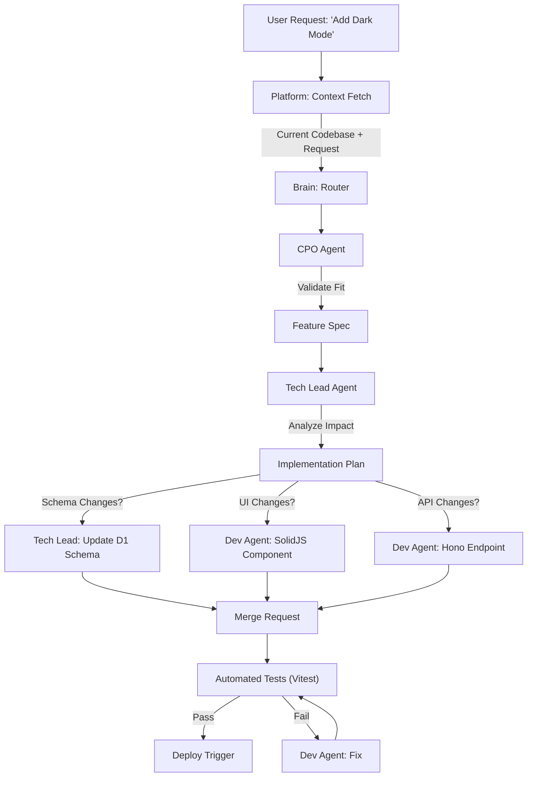

# New Feature Workflow (Iteration 🔄)

**Objective**: Add functionality to an existing codebase safely.
**Trigger**: User request for a new feature.

## Workflow Diagram

## Phases

### Phase 1: Specification

1. User requests new feature with context
2. CPO Agent validates feature fit with product strategy
3. Feature specification generated

### Phase 2: Planning

1. Tech Lead analyzes impact on existing architecture
2. Implementation plan created with:
   - Schema changes (if needed)
   - UI/Frontend changes (if needed)
   - API/Backend changes (if needed)

### Phase 3: Implementation

1. Dev Agents implement changes in parallel:
   - Database schema updates (D1)
   - SolidJS components
   - Hono API endpoints
2. Code merged to main branch

### Phase 4: Testing & Deployment

1. Automated tests (Vitest) run
2. If pass: deploy trigger activated
3. If fail: Dev Agent fixes issues and tests again

## Agents Involved

- **CPO Agent**: Feature fit validation, product alignment
- **Tech Lead Agent**: Impact analysis, architecture review
- **Dev Agents**: Implementation of schema, frontend, backend changes
- **Automated Testing**: Vitest suite execution

## Decision Gates

- **Feature Fit**: Does it align with product strategy?
- **Schema Impact**: Do we need to modify the database?
- **UI Impact**: Do frontend changes break existing UX?
- **API Impact**: Do backend changes require version management?
- **Test Coverage**: All tests pass before deployment?
