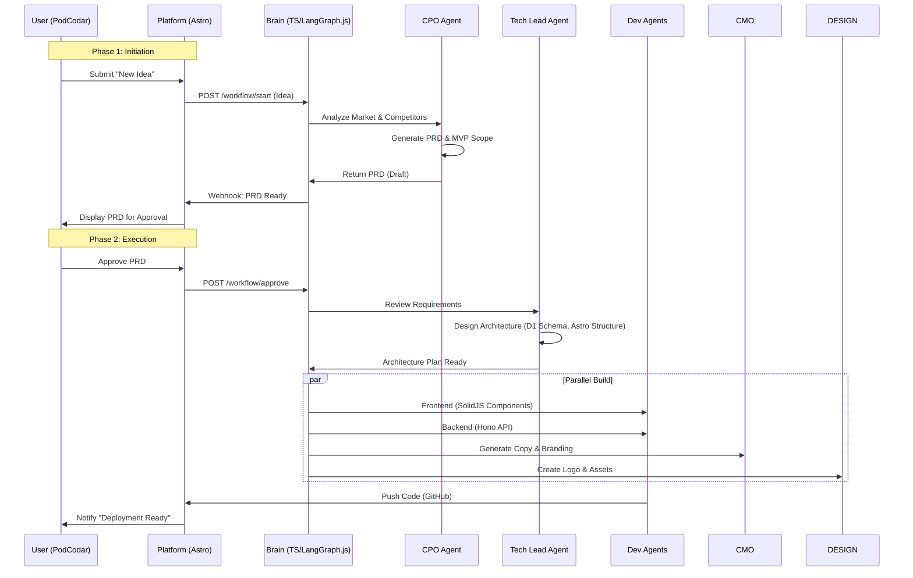

# New Product Workflow (Zero to One 🚀)

**Objective**: Convert a raw idea into a deployed MVP.
**Trigger**: User submits a new idea via the Platform.

## Workflow Diagram

## Phases

### Phase 1: Initiation

1. User submits idea with initial context
2. CPO Agent analyzes market fit and competitors
3. CPO generates PRD (Product Requirements Document) with MVP scope
4. User reviews and approves PRD

### Phase 2: Execution

1. Tech Lead designs architecture and schema
2. Dev Agents, CMO, and Designer work in parallel:
   - Frontend components (SolidJS)
   - Backend API (Hono)
   - Marketing copy & branding
   - Logo & visual assets
3. Code pushed to GitHub triggers deployment

## Agents Involved

- **CPO Agent**: Market analysis, PRD generation, MVP scope definition
- **Tech Lead Agent**: Architecture design, schema planning, technical review
- **Dev Agents**: Frontend and backend implementation
- **CMO Agent**: Copy generation, brand voice, messaging
- **Designer Agent**: Logo and visual asset creation
