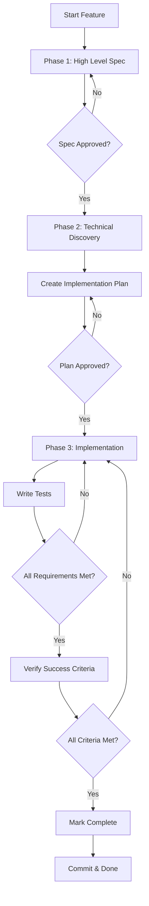

# Spec-Driven Development

## Workflow Overview

The Spec-Driven Development (SDD) process consists of three distinct phases, each requiring human approval before proceeding to the next step:

1. **High Level Spec** - Initial requirements and context gathering
2. **Detailed Implementation Plan** - Technical discovery and implementation details
3. **Implementation** - Actual code implementation

## Three-Phase Workflow



## Phase 1: High Level Spec

**Purpose**: Gather initial context, define requirements, and establish the "what" and "why" of the feature.

**Deliverable**: `specs/XXX-feature-name.md`

**Steps**:

1. Copy `specs/000-spec-template.md` → `specs/XXX-feature-name.md`
2. Fill out all sections:
   - Feature Name
   - Objective
   - User Story
   - Functional Requirements
   - Success Criteria
   - Notes (constraints, assumptions, etc.)
3. Use this phase to:
   - Understand the problem domain
   - Research existing solutions (e.g., `phx.gen.auth` capabilities)
   - Define what needs to be built
   - Identify unknowns and questions

**Approval Gate**: Human reviewer must approve the spec before proceeding to Phase 2.

**Questions to Answer**:

- What problem are we solving?
- What are the functional requirements?
- What are the success criteria?
- What is out of scope?

## Phase 2: Detailed Implementation Plan

**Purpose**: Technical discovery, clarify implementation details, and create a step-by-step plan for building the feature.

**Deliverable**: `specs/XXX-feature-name.plan.md`

**Steps**:

1. Copy `specs/000-implementation-plan-template.md` → `specs/XXX-feature-name.plan.md`
2. Reference the approved High Level Spec
3. Conduct technical research:
   - Review relevant documentation
   - Examine existing codebase patterns
   - Identify dependencies and integrations
   - Research best practices
4. Fill out implementation plan:
   - File-by-file changes
   - Database migrations needed
   - Configuration changes
   - Testing strategy
   - Dependencies to add
   - Step-by-step implementation order

**Approval Gate**: Human reviewer must approve the implementation plan before proceeding to Phase 3.

**Questions to Answer**:

- How will we implement each requirement?
- What files need to be created/modified?
- What are the technical dependencies?
- What is the implementation order?
- Are there any blockers or risks?

## Phase 3: Implementation

**Purpose**: Write code, tests, and documentation based on the approved implementation plan.

**Deliverable**: Working feature with tests

**Steps**:

1. Follow the approved implementation plan step-by-step
2. Write code for each component
3. Write tests as you go
4. Update documentation as needed
5. Verify all success criteria are met
6. Run `mix precommit` to ensure code quality

**Approval Gate**: Code review and testing before merge.

**Questions to Answer**:

- Does the code match the implementation plan?
- Do all tests pass?
- Are all success criteria met?
- Does the code follow project guidelines?

## Quick Reference

### Creating a New Feature

```bash
# Phase 1: High Level Spec
cp specs/000-spec-template.md specs/004-my-feature.md
# ... fill out spec ...
# ... get approval ...

# Phase 2: Implementation Plan
cp specs/000-implementation-plan-template.md specs/004-my-feature.plan.md
# ... fill out plan ...
# ... get approval ...

# Phase 3: Implementation
# ... write code following the plan ...
```

### File Naming Convention

- High Level Spec: `specs/XXX-feature-name.md`
- Implementation Plan: `specs/XXX-feature-name.plan.md`
- Number sequentially: `001`, `002`, `003`, etc.

## Why This Process?

- **Phase 1 (Spec)**: Ensures we understand the problem before diving into solutions
- **Phase 2 (Plan)**: Reduces implementation risk by planning technical details upfront
- **Phase 3 (Implementation)**: Focused coding with clear guidance

### Benefits

- Clear requirements before coding
- Better tests (test against spec and plan)
- Less scope creep
- Reduced rework
- Self-documenting features
- Technical risks identified early

## Tips

- **Phase 1**: Don't worry about implementation details yet - focus on "what" and "why"
- **Phase 2**: Be thorough - this is where you ask clarifying questions and research
- **Phase 3**: Follow the plan, but don't hesitate to update it if you discover issues
- Keep specs and plans updated if requirements change
- Reference spec/plan in commit messages
- Mark complete when done: `[x] Complete` in spec file

## Approval Process

Each phase requires explicit approval from a human reviewer before proceeding:

1. **Spec Approval**: Review the high-level spec for completeness, clarity, and alignment with project goals
2. **Plan Approval**: Review the implementation plan for technical feasibility, completeness, and risk assessment
3. **Code Approval**: Standard code review process

**Note**: Do not proceed to the next phase without explicit approval from the human reviewer.
