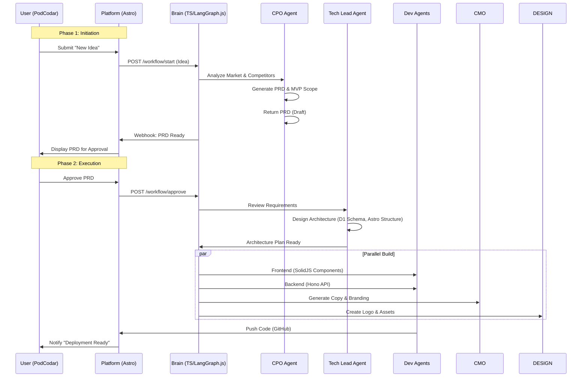
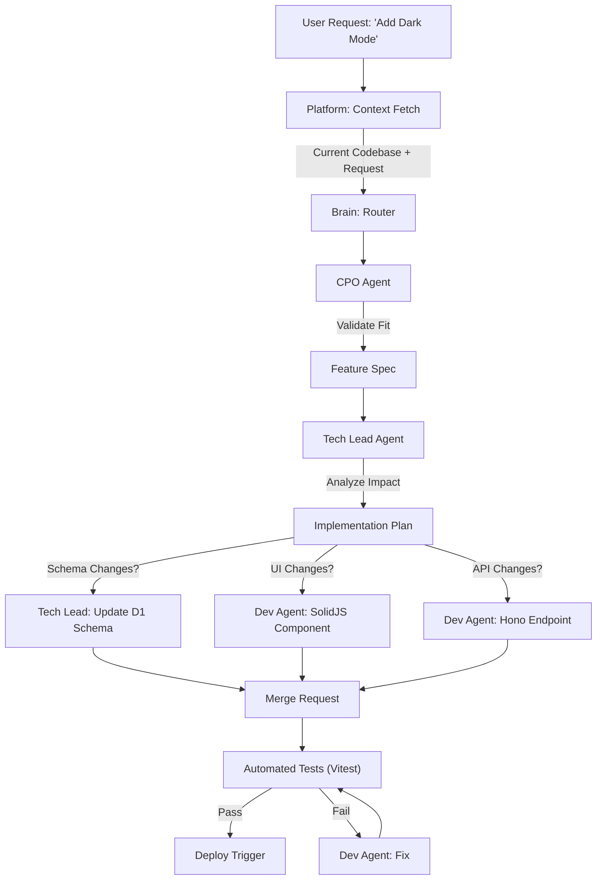
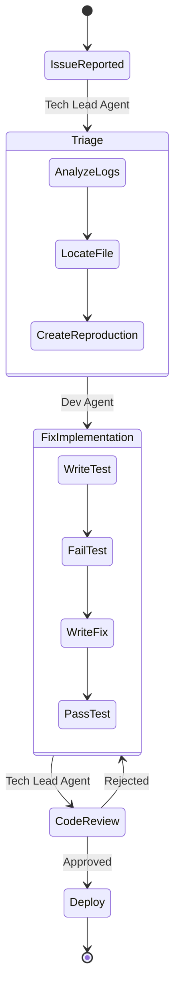

# AI Agent Workflows

This document visualizes the operational workflows of the TremTec Accelerator, showing how the AI Agents collaborate to build and maintain products.

## 1. New Product Workflow (Zero to One 🚀)

**Objective**: Convert a raw idea into a deployed MVP.
**Trigger**: User submits a new idea via the Platform.

## 2. New Feature Workflow (Iteration 🔄)

**Objective**: Add functionality to an existing codebase safely.
**Trigger**: User request for a new feature.

## 3. Bug Fix Workflow (Maintenance 🛠️)

**Objective**: Resolve errors or bugs reported by users or monitoring.
**Trigger**: Error log or user report.

